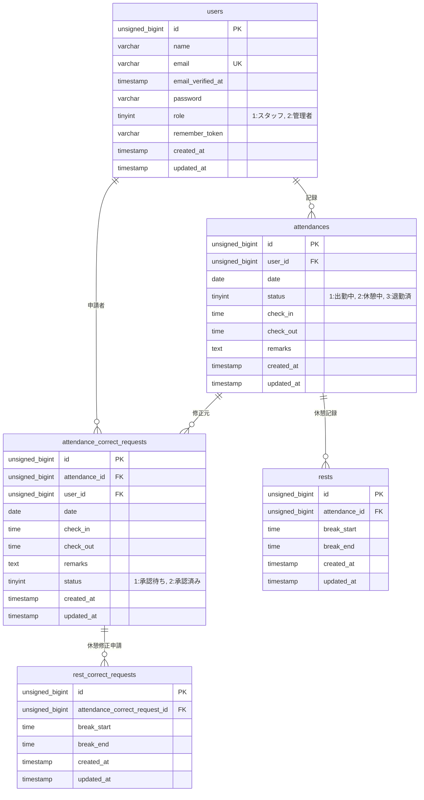

# 勤怠管理アプリ

## 環境構築

### 1. リポジトリのクローンと環境準備

1. プロジェクトをクローンし、Dockerコンテナを起動します。

   ```bash
   git clone git@github.com:sappy3105/attendance-management.git
   cd attendance-management
   docker-compose up -d --build
   ```

2. プロジェクト直下で、以下のコマンドを実行します。

   ```bash
   make init
   ```

### 2. 各種サービスの設定 (.env)

#### 2-1. データベース設定

`.env`ファイルに以下の環境変数を追加してください。

```env
DB_USERNAME=laravel_user
DB_PASSWORD=laravel_pass
```

#### 2-2. 開発環境でのメール認証システム設定 (Mailtrap)

本プロジェクトでは、メール認証のテストに [Mailtrap](https://mailtrap.io/) を使用しています。  
機能を再現するには、以下の手順で設定を行ってください。

**1. Mailtrap のセットアップ**

1. [Mailtrap公式サイト](https://mailtrap.io/)でアカウントを作成します。
2. ログイン後、左メニューの「Sandboxes」→「My Sandbox」をクリックします。
3. 「Integration」タブが選択されていることを確認し、その下の「SMTP」を選択します。
4. 表示された `Credentials` 欄の `Username` と `Password` を確認します。
5. 「My Sandbox」ページのURL(`https://mailtrap.io/inboxes/数字/messages`) をコピーします。

**2. 環境設定 (.env)**

プロジェクト直下の `.env` ファイルに、確認した値を反映させてください。

```env
MAIL_USERNAME=確認したユーザー名
MAIL_PASSWORD=確認したパスワード
MAIL_DASHBOARD_URL=「My Sandbox」ページのURL
```

#### 2-3. アプリケーションの初期化

以下のコマンドを実行して、アプリケーションの初期化を行います。

```bash
make cache
```

### 3. フロントエンドの環境構築

本プロジェクトでは Autoprefixer を使用して CSS のブラウザ互換性を管理しています。スタイルを正しく反映させるため、以下の手順を実行してください。

```bash
# 1. ビルドの実行
# 開発用（変更を確認したい場合など）
make dev

# 本番用（ファイルを最適化・圧縮したい場合）
make build
```

もし `make dev` でエラーが出る場合は、以下のコマンドを試してから再度ビルドしてください。

```bash
docker-compose exec php npm install postcss-loader autoprefixer --save-dev
```

## 使用技術（実行環境）

- PHP 8.3.30
- Laravel 12.53.0
- MySQL 8.0.26
- nginx 1.21.1

## URL

- 開発環境： http://localhost/
- phpMyAdmin： http://localhost:8080/

## 動作確認ガイド（動作確認用データの構成）

本プロジェクトでは、管理者ユーザー1名および一般ユーザー6名、その一般ユーザー6名分の昨日までの30日間の勤怠データを投入しています。  
セットアップ完了後、以下の動作確認用データを使用して各機能を確認いただけます。

**1. データの初期化**

リポジトリをクローンし、環境構築が完了した後、以下のコマンドを実行してデータベースを最新の状態にします。  
※ `make init` 実行直後の場合は、この作業はスキップしてください。

```bash
make fresh
```

**2. 動作確認用アカウント**

動作確認には以下の固定ユーザーを使用してください。パスワードは全て共通です。

**◇管理者ユーザー登録情報**

| ID  | ユーザー名  | メールアドレス    | パスワード |
| :-: | :---------- | :---------------- | :--------- |
|  1  | 管理者 太郎 | admin@example.com | admin_pass |

**◇一般ユーザー登録情報**

| ID  | ユーザー名 | メールアドレス     | パスワード |
| :-: | :--------- | :----------------- | :--------- |
|  2  | 田中 一郎  | staff1@example.com | staff_pass |
|  3  | 鈴木 二郎  | staff2@example.com | staff_pass |
|  4  | 高橋 三郎  | staff3@example.com | staff_pass |
|  5  | 渡辺 四郎  | staff4@example.com | staff_pass |
|  6  | 伊藤 五郎  | staff5@example.com | staff_pass |
|  7  | 山本 六郎  | staff6@example.com | staff_pass |

**3. 自動生成される勤怠データの構成**

ログイン後、すぐに機能を確認いただけるよう、シーディングによって以下のデータが自動生成されます。

- 過去30日分の勤怠実績: 土日を除く直近30日間の出勤・退勤データが全一般ユーザー分作成されます。

- 修正申請のシミュレーション:
  - 全勤怠データのうち 10% に対して、既に修正申請が行われた状態を再現しています。

  - それらの申請のうち半分は 「承認待ち」、残り半分は 「承認済み」 となっており、管理者・ユーザーそれぞれの画面で異なる状態の申請リストを確認可能です。

## テーブル仕様書（概要）

| テーブル名                  | 説明                                                         |
| :-------------------------- | :----------------------------------------------------------- |
| users                       | 利用者（一般ユーザー・管理者ユーザー）の認証・属性情報を管理 |
| attendances                 | 日ごとの出勤・退勤時間、および現在の勤務ステータスを記録     |
| rests                       | 勤務中の休憩開始・終了時間を記録（1日複数回対応）            |
| attendance_correct_requests | 勤怠修正申請の履歴と承認ステータスを管理                     |
| rest_correct_requests       | 勤怠修正申請に紐づく休憩修正申請の履歴                       |

## ER 図


